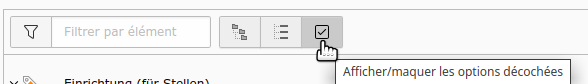

==============
EXT:selecttree
==============

*TYPO3 extension*

Backport optimizations for TCA renderType **selectTree** for TYPO3 < v13.

This backports some changes which did not get backported for version

*  v12
*  (might also work with v11, todo)

Changes
=======

*  Add (English) language labels and translations for selectTree (includes
   languages Danish, French, German ...)

      *  based on patch: https://review.typo3.org/c/Packages/TYPO3.CMS/+/87465
      *  issue: https://forge.typo3.org/issues/105790

